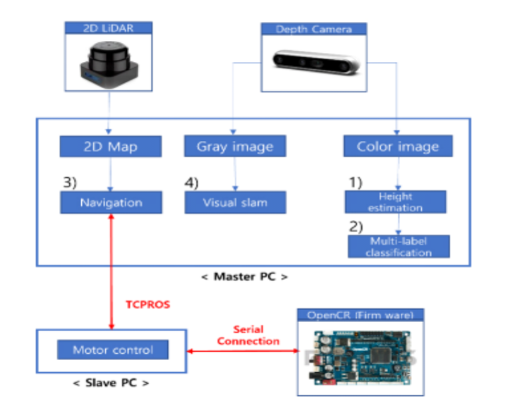
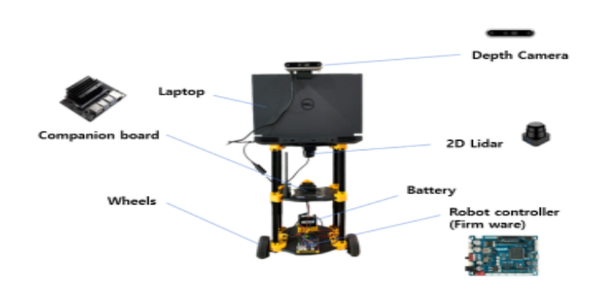
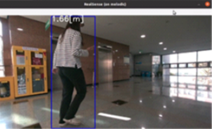

# Deeplearning based missing child detection system : Herobot

## Reference site

- [Multilbel classification](https://debuggercafe.com/multi-label-image-classification-with-pytorch-and-deep-learning/)
- [Height estimation](https://github.com/IntelRealSense/librealsense/blob/master/wrappers/tensorflow/example2%20-%20person%20height.py)

## System model 



## Hardware configuration


## Quick start

Execute ROS master 

```
roscore
```

Run input launch file and Put input value

```
roslaunch herobot input.launch
```


Run control launch file

```
roslaunch herobot controller.launch 
```

## Deep-learning Result
1. Height Estimation Result


2. Multi-label classification


## Video


## Paper

- [__Deep-learning based missing child detection assistance system using autonomous robot__](https://journal.kics.or.kr/digital-library/99400)

```
@article{
  title={Deep-Learning Based Missing Child Detection Assistance System Using Autonomous Robot},
  author={Yeong Eun Choi, Su Hyeong Kang, So Yeon Kim, Soo Young Shin},
  journal={The Journal of Korean Institute of Communications and Information Sciences},
  volume={49},
  number={7},
  pages={1021--1029},
  year={2024},
}
```
